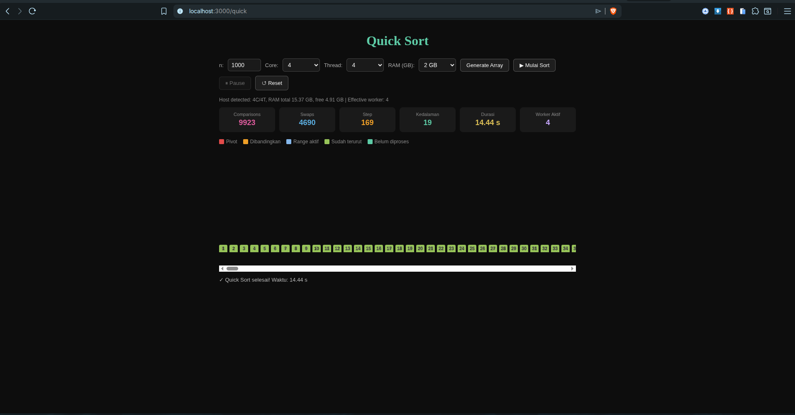
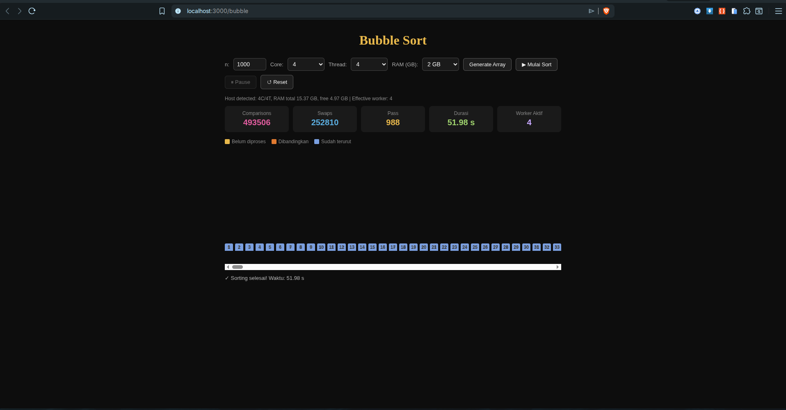

# Sort Visualizer (Node.js + EJS)

Aplikasi visualisasi **Bubble Sort** dan **Quick Sort** berbasis:
- Node.js (Express)
- EJS (template engine)
- Web Worker (parallel sorting)

## Prasyarat
- Node.js 18+ (disarankan versi LTS)
- npm

## Instalasi
```bash
npm install
```

## Menjalankan Aplikasi
```bash
npm run start
```

Server default berjalan di:
- `http://localhost:3000`

## Routes
- `/` : halaman landing (pilih Bubble / Quick)
- `/bubble` : visualizer Bubble Sort
- `/quick` : visualizer Quick Sort
- `/api/system/resources` : API resource host (core/thread/RAM)

## Preview
### Quick Sort


### Bubble Sort


## Catatan
- Aplikasi akan mendeteksi resource host dari endpoint backend `/api/system/resources`.
- Jika fetch gagal, frontend memakai fallback lokal otomatis.
- Alokasi `core/thread/RAM` saat ini **belum 100% kontrol nyata level OS**.
- Implementasi saat ini bekerja di level aplikasi/browser:
  - `thread` mengatur jumlah Web Worker efektif,
  - `RAM` dipakai sebagai estimasi/guard agar job tidak dijalankan jika melebihi batas,
  - `core` membatasi pilihan thread.
- Browser tidak memberi kontrol absolut untuk pinning CPU core atau hard-limit RAM proses JS seperti container/OS.

## Struktur Folder Utama
- `server.js` : server Express + routes + API
- `views/` : template EJS (`index.ejs`, `bubble.ejs`, `quick.ejs`)
- `public/css/` : stylesheet per halaman
- `public/js/` : script per halaman
- `cpp-sort/` : versi C++ untuk penggunaan resource OS-level

## Development Cepat
Perintah ini sama-sama menjalankan server:
```bash
npm run dev
```

## C++ OS-Level Sorter
CLI sorter C++ untuk penggunaan resource lebih nyata di level OS.

### Fitur
- Algoritma: `quick` dan `bubble` (odd-even parallel)
- Thread nyata via `std::thread`
- Opsi pinning thread ke core (`--pin-cores`, Linux)
- Batas memori proses via `RLIMIT_AS` (`--ram-mb`, Linux)
- Output metrik durasi, comparisons, swaps

### Build
```bash
cd cpp-sort
cmake -S . -B build
cmake --build build -j
```

### Run
```bash
./build/sorter --algo quick --n 100000 --threads 4 --ram-mb 1024 --pin-cores
./build/sorter --algo bubble --n 20000 --threads 4 --ram-mb 1024
```

### Argumen
- `--algo quick|bubble`
- `--n <jumlah elemen>`
- `--threads <jumlah thread>`
- `--ram-mb <batas RAM proses dalam MB>`
- `--pin-cores` (opsional, Linux)
- `--no-verify` (opsional, skip validasi sorted)

### Catatan
- `--ram-mb` dan `--pin-cores` paling efektif di Linux.
- Untuk kontrol resource yang konsisten di production, jalankan via cgroup/systemd/Docker.

## Node.js CLI Sorter (OS-level Process)
Versi CLI tanpa browser, berjalan langsung sebagai proses Node.js.

Jalankan:
```bash
npm run cli:sort -- --algo quick --n 100000 --threads 4 --ram-mb 1024
npm run cli:sort -- --algo bubble --n 20000 --threads 4 --ram-mb 1024
```

Argumen:
- `--algo quick|bubble`
- `--n <jumlah elemen>`
- `--threads <jumlah worker_threads>`
- `--ram-mb <budget RAM total untuk worker>`
- `--seed <angka>`
- `--no-verify`

Catatan:
- Ini proses OS-level (bukan browser), jadi tidak terkena batasan Web Worker UI.
- RAM diatur per worker lewat `resourceLimits.maxOldGenerationSizeMb` (V8), dan thread nyata via `worker_threads`.
- Untuk kontrol OS yang lebih keras (affinity/cgroup), jalankan bersama tool OS seperti `taskset`/Docker/cgroup.
